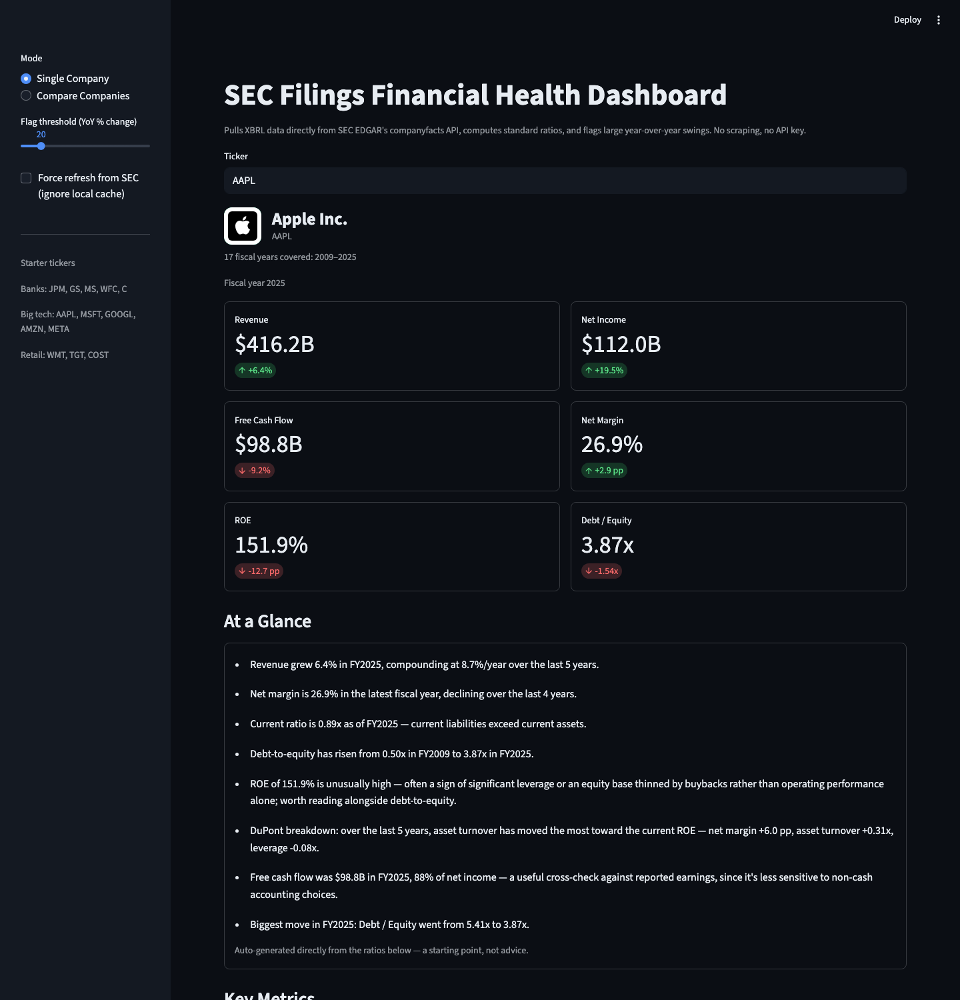

# SEC Filings Financial Health Dashboard

[](https://github.com/grantkurtz378-beep/sec-filings-dashboard/actions/workflows/ci.yml)
[](LICENSE)


A tool that pulls real financial data straight from public companies' SEC filings,
computes the ratios analysts actually use, and flags which ones moved a lot year over
year — plus a DuPont ROE decomposition and free cash flow, not just the basics. Runs as
a local Streamlit dashboard.

Built a financial analysis dashboard parsing SEC EDGAR XBRL filings data for 13 public
companies, computing liquidity/profitability/DuPont ratios and free cash flow, flagging
significant YoY changes with a 43-test regression suite (85% coverage) covering four real
data-quality bugs across the XBRL pipeline and the narrative layer (Python, pandas,
Streamlit).



## What it does

- **Data pipeline**: given a ticker, resolves the CIK via SEC's `company_tickers.json`,
  pulls every XBRL-tagged fact from `data.sec.gov/api/xbrl/companyfacts/`, and parses it
  into one clean row per fiscal year. No scraping, no API key, no auth. Requests retry
  with backoff on transient failures (SEC rate limits, momentary 5xx) instead of crashing
  the page on a one-off network blip.
- **Ratio engine**: gross/net margin, current ratio, debt-to-equity, ROE, ROA, free cash
  flow (+ FCF margin), YoY revenue growth, YoY net income growth, and a full DuPont
  decomposition of ROE (Net Margin × Asset Turnover × Equity Multiplier) so a reader can
  see *what's actually driving* a return figure rather than taking it at face value.
- **Flagging**: any ratio that swings more than a configurable threshold (default 20%)
  year over year gets highlighted — green for a move in the healthy direction, red for
  the other way, rather than treating every big swing as bad news.
- **Dashboard**: company header with a logo (falls back to a colored letter badge if no
  logo is found), 6 KPI cards, a plain-English "At a Glance" summary generated directly
  from the computed ratios (no LLM call — every line traces to a number on the page), a
  sparkline summary table, a DuPont breakdown table, trend charts, a flagged ratio table,
  a raw-financials view, and an in-app "Methodology & data quality notes" panel — plus a
  multi-company comparison mode (2-8 tickers side by side with logos, e.g. a sector
  cohort like the big banks or big tech).
- **Tested**: 43 tests (85% coverage of `src/`) covering the pipeline, ratio math,
  flagging logic, the narrative generator, and the network retry layer — each one
  reproducing a real bug this project found on real SEC data, not a synthetic exercise.
  Runs in CI on every push (badge above).

## Why this is harder than "call an API"

SEC's raw XBRL data has sharp edges that will silently corrupt your numbers if you don't
handle them. Each of these was found by testing against real data, not assumed — and
each has a regression test in `tests/` so it can't quietly come back.

- **Comparative-year mislabeling.** A 10-K reports 2-3 years of comparative figures, and
  SEC's companyfacts API stamps ALL of them with the filing's own fiscal-year focus — so a
  company's FY2012 10-K relabels its FY2010 net income as `fy: 2012`. Grouping facts by
  the `fy` field (the obvious approach) silently overwrites current-year numbers with
  stale prior-year values. The fix: key on the fact's `end` date (unambiguous) and derive
  the display fiscal year as the earliest `fy` ever attached to that date.
- **Revenue (and CapEx) tag drift.** Most companies moved off `Revenues` onto
  `RevenueFromContractWithCustomerExcludingAssessedTax` after adopting ASC 606 (~2018).
  Broker-dealers (Goldman Sachs, Morgan Stanley) report `RevenuesNetOfInterestExpense`
  instead, since interest is a cost of their core trading business. The same drift hits
  the capex tag (`PaymentsToAcquireProductiveAssets` → `...PropertyPlantAndEquipment`,
  confirmed by an identical value reported under both tags for Apple's FY2013). One
  fallback-chain mechanism handles both.
- **Missing subtotals.** Some filers (Walmart, for one) never tag `Liabilities` as its own
  line item — it's recoverable from `Assets - StockholdersEquity`, but only if you know to
  look for it.
- **Balance sheet structure varies by industry.** Banks and broker-dealers don't file a
  classified balance sheet, so `AssetsCurrent` / `LiabilitiesCurrent` (current ratio) and
  `CostOfRevenue` / `GrossProfit` (gross margin) genuinely don't exist for them. The
  dashboard detects this and shows "N/A" instead of guessing.
- **A judgment call, not just a bug fix.** Free cash flow is suppressed for banks and
  broker-dealers even on the rare filer (Goldman, Citi) that happens to tag a capex line —
  their operating cash flow reflects swings in trading inventory, loans, and deposits, not
  core-business cash generation, so the subtraction is mechanically possible but not the
  number FCF is meant to represent. Detecting "is this a financial institution" reuses the
  same classified-balance-sheet signal already needed for current ratio, rather than
  adding a second, separate heuristic.
- **A bug in the narrative layer, not just the data layer.** Testing against AT&T (a
  ticker outside the original 13) surfaced a real bug in the DuPont "biggest mover"
  summary: dividing by a negative base year (AT&T had a loss in FY2020) produced "net
  margin -583%" — backwards, since the underlying move was actually an improvement. Fixing
  the sign (`(new-old)/abs(old)`, not a plain percent change) revealed a second issue: the
  *magnitude* is still unstable near a zero base even once the sign is right. The real fix
  was architectural — rank which DuPont factor moved most using relative change (valid for
  comparing differently-scaled factors), but *display* each one in its own natural unit
  (percentage points for a margin, "x" for a multiple) instead of a percent-of-a-percent.
  `generate_summary()` was also extracted out of `app.py` into `src/narrative.py` so this
  logic - where the bug actually lived - has direct unit tests instead of being unreachable
  behind Streamlit's UI code.

## Testing

```bash
./venv/bin/pip install -r requirements-dev.txt
./venv/bin/pytest --cov=src --cov-report=term-missing
```

43 tests, 85% coverage of `src/`, no network calls (everything is built from minimal
synthetic XBRL fixtures in `tests/conftest.py` that reproduce the exact real-world quirks
above), runs in under a second. CI (`.github/workflows/ci.yml`) runs the same suite with
coverage on Python 3.9 and 3.11 on
every push and PR.

## Setup

```bash
git clone https://github.com/grantkurtz378-beep/sec-filings-dashboard.git
cd sec-filings-dashboard
python3 -m venv venv
./venv/bin/pip install -r requirements.txt
```

## Run it

```bash
./run.sh
```

Opens at `http://localhost:8501`. Enter any ticker (AAPL, JPM, WMT, ...) in the sidebar.

## Deploying it live

This repo is deploy-ready for [Streamlit Community Cloud](https://streamlit.io/cloud)
(free, no credit card): sign in with GitHub, "New app," point it at this repo and
`app.py`, deploy. Takes about two minutes and gives you a public URL worth putting in a
resume or LinkedIn Featured section instead of a "clone and run" link.

## Data source

- Ticker → CIK: `https://www.sec.gov/files/company_tickers.json`
- Company facts (all XBRL-tagged data ever filed): `https://data.sec.gov/api/xbrl/companyfacts/CIK##########.json`

Requests are rate-limited to well under SEC's 10 req/sec cap, retry with backoff on
transient failures, and identify with a real contact in the User-Agent header (SEC blocks
requests without one). Responses are cached locally in `data/sec_cache.db` (SQLite) so
re-running the app doesn't re-hit the API; use the "Force refresh" checkbox in the sidebar
to bypass the cache.

## Project layout

```
app.py                    Streamlit UI (single-company + comparison modes)
src/edgar_client.py       SEC API client: CIK lookup, rate limiting + retry, SQLite caching
src/pipeline.py           Raw XBRL JSON -> one row per fiscal year
src/ratios.py             Ratio calculations, DuPont decomposition, free cash flow
src/flags.py              YoY flagging logic
src/narrative.py          "At a Glance" summary generator + shared formatting/labels
tests/                    43 tests + synthetic XBRL fixtures reproducing real bugs
.github/workflows/ci.yml  Runs the test suite (with coverage) on every push (Python 3.9 + 3.11)
data/                     SQLite cache + downloaded ticker map (gitignored)
```

## Starter tickers

- Banks: JPM, GS, MS, WFC, C
- Big tech: AAPL, MSFT, GOOGL, AMZN, META
- Retail: WMT, TGT, COST

## Known limitations

- A company's earliest 1-3 fiscal years in EDGAR's XBRL history (before it had its own
  correctly-labeled filing) can't always be given an unambiguous fiscal-year label and are
  dropped rather than mislabeled — the underlying `end` dates are always shown in the raw
  financials view regardless.
- A handful of companies have inconsistent fiscal-year tagging in their own SEC filings
  (Walmart skips a fiscal-year number in its own DEI metadata around 2014/2015). The
  underlying period (`end` date) and values are correct either way; only the fiscal-year
  label can look off for that one row.
- ROE/ROA/asset turnover/equity multiplier use ending-period balances rather than a period
  average, which is the standard simplification for a tool like this but will differ
  slightly from figures that average beginning and ending balances.

## Possible next steps

- AI-assisted read on risk factors: pull "Item 1A Risk Factors" from two consecutive 10-Ks
  via EDGAR's full-text search and have an LLM summarize what changed year over year.
